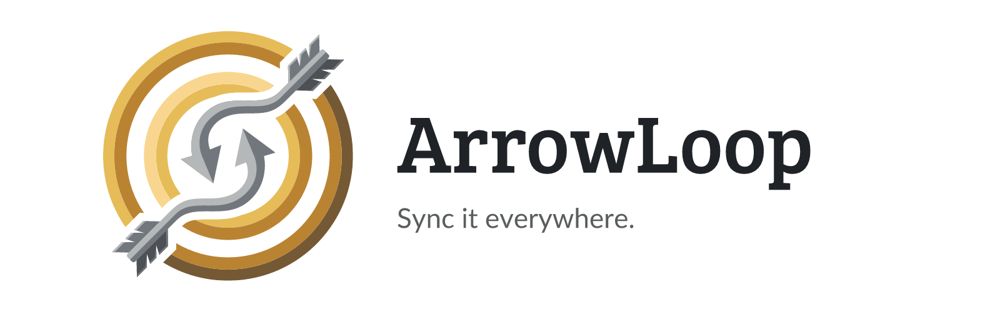
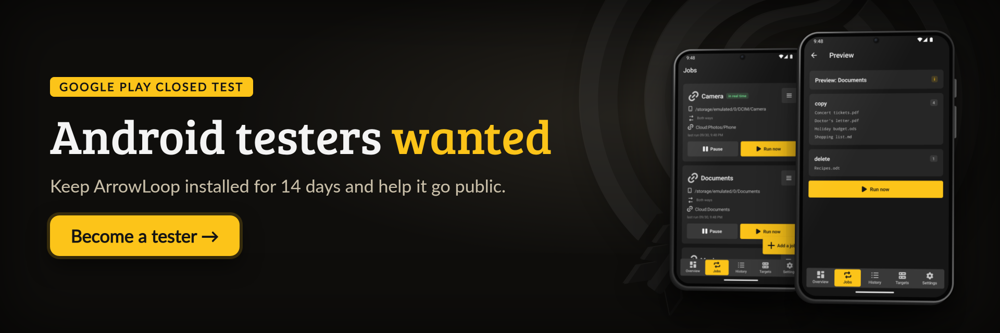
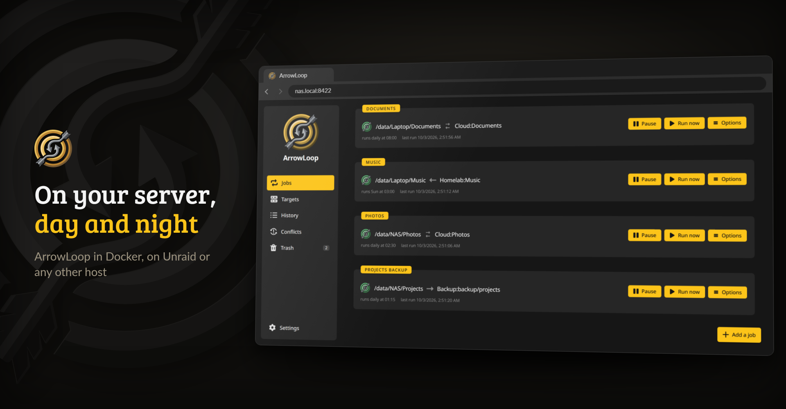
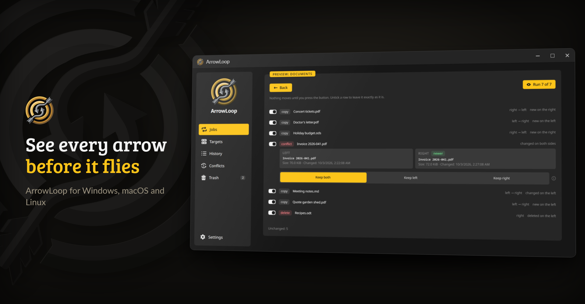
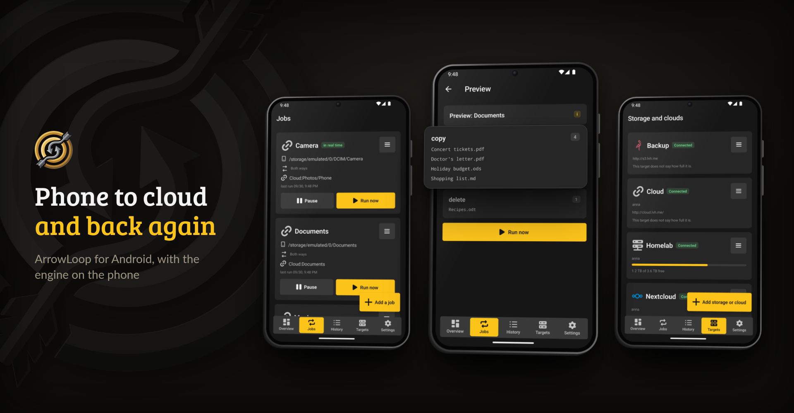

<p align="center">
  <picture>
    <source media="(prefers-color-scheme: dark)" srcset=".github/assets/banner-dark.png">
    
  </picture>
</p>

<p align="center">
  <a href="https://github.com/junkerderprovinz/arrowloop/actions/workflows/ci.yml"></a>&nbsp;
  <a href="https://github.com/junkerderprovinz/arrowloop/actions/workflows/container.yml"></a>&nbsp;
  <a href="https://hub.docker.com/r/junkerderprovinz/arrowloop"></a>&nbsp;
  <a href="https://hub.docker.com/r/junkerderprovinz/arrowloop"></a>&nbsp;
  <a href="https://github.com/junkerderprovinz/arrowloop/pkgs/container/arrowloop"></a>&nbsp;
  <a href="https://rclone.org"></a>&nbsp;
  <a href="https://ca.unraid.net/apps/arrowloop-04rvnbl1yv3wn1"></a>&nbsp;
  <a href="LICENSE"></a>&nbsp;
  <a href="https://junkerderprovinz.github.io/arrowloop/"></a>
</p>

<br>

<p align="center">
<b>Two-way file sync that shows you the plan before it moves anything.</b><br>
<br>
ArrowLoop keeps two folders in step, say a NAS share and a laptop, or a phone and a WebDAV cloud. It remembers what both sides last agreed on, lists every change before a run, and stops rather than delete more than it should.
</p>

<p align="center">
  <a href="https://play.google.com/apps/testing/arrowloop.halleluja.design"></a>
</p>

> [!IMPORTANT]
> **Android testers wanted.** Google Play only lists an app from a new developer account after at least 12 testers have kept it installed for 14 days. If you have an Android phone:
>
> 1. Join the [tester group](https://groups.google.com/g/arrowloop-testers).
> 2. Open the [test page](https://play.google.com/apps/testing/arrowloop.halleluja.design) and tap **Become a tester**.
> 3. Install ArrowLoop from Google Play and keep it for 14 days. Using it for real helps most, and anything that goes wrong is welcome as an [issue](https://github.com/junkerderprovinz/arrowloop/issues).

<!-- download-buttons: written by scripts/gen_download_buttons.py -->
<p align="center">
  <a href="https://ca.unraid.net/apps/arrowloop-04rvnbl1yv3wn1"></a>
  &nbsp;
  <a href="https://hub.docker.com/r/junkerderprovinz/arrowloop/"></a>
  &nbsp;
  <a href="https://github.com/junkerderprovinz/arrowloop/releases/latest"></a>
  &nbsp;
  <a href="https://junkerderprovinz.github.io/arrowloop/"></a>
</p>
<br>
<p align="center">
  <a href="https://github.com/junkerderprovinz/arrowloop/releases/latest/download/arrowloop-windows-amd64-installer.exe"></a><a href="https://github.com/junkerderprovinz/arrowloop/releases/latest/download/arrowloop-windows-arm64-installer.exe"></a>
  &nbsp;
  <a href="https://github.com/junkerderprovinz/arrowloop/releases/latest/download/arrowloop-macos-universal.dmg"></a>
  &nbsp;
  <a href="https://github.com/junkerderprovinz/arrowloop/releases/latest/download/arrowloop-linux-amd64"></a><a href="https://github.com/junkerderprovinz/arrowloop/releases/latest/download/arrowloop-linux-arm64"></a>
</p>
<br>
<p align="center">
  
  &nbsp;
  <a href="https://github.com/junkerderprovinz/arrowloop/releases/latest/download/arrowloop-android-arm64.apk"></a>
  <br><sub>Always downloads the latest build</sub>
</p>
<!-- /download-buttons -->

<br>

<p align="center">
A one-knight job: I build it, keep it running, work through the issues and add what people ask for, until nothing is missing. It is free, with no accounts, no telemetry, no ads and no paid tier. No asterisk anywhere. Nothing readable ever leaves your own walls. Forged on evenings and weekends, with heart and stubbornness.
</p>

<p align="center">
If it has earned a place on your server or computer, toss a coin to your knight: it helps cover the costs and keeps the project alive. It also makes this knight's heart beat a little faster. Three ways below, whichever suits you.
</p>

<!-- give-buttons: written by scripts/gen_download_buttons.py -->
<p align="center">
  <a href="https://buymeacoffee.com/junkerderprovinz"></a>
  &nbsp;
  <a href="https://www.paypal.com/donate/?hosted_button_id=76FVV52TKXTUS"></a>
  &nbsp;
  <a href="https://junkerderprovinz.github.io/junkerderprovinz/"></a>
</p>
<!-- /give-buttons -->


<br>

## Table of Contents

1. [What it looks like](#1-what-it-looks-like)
2. [What it does](#2-what-it-does)
3. [How it compares](#3-how-it-compares)
4. [Getting started](#4-getting-started)
5. [Documentation](#5-documentation)
6. [How AI is used here](#6-how-ai-is-used-here)
7. [Support this project](#7-support-this-project)

<br>

## 1. What it looks like

<p align="center">
  
  <br><em>The container's web interface, in any browser on your network</em>
</p>

<p align="center">
  
  <br><em>The same interface as a desktop app: every copy, deletion and conflict of the next run, before anything moves</em>
</p>

<p align="center">
  
  <br><em>The Android app, with the engine running on the phone</em>
</p>

<br>

## 2. What it does

- **Two-way, with a memory.** A state database per job tells a new file from a deleted one, so nothing deleted comes back and nothing new disappears. [How it decides](https://junkerderprovinz.github.io/arrowloop/decisions/)
- **A plan before every run.** The preview lists every copy, deletion and conflict. Untick a row and that file stays exactly as it is. [The interface](https://junkerderprovinz.github.io/arrowloop/interface/)
- **Brakes instead of surprises.** Deletions go to a trash, a run that would delete too much or finds a side suddenly empty stops, and a crash at any step can be picked up again. [Safety](https://junkerderprovinz.github.io/arrowloop/safety/)
- **Over 60 clouds and servers.** Every rclone backend is built in: SMB, SFTP, S3, WebDAV, Nextcloud, OneDrive, Google Drive and the rest. [Configuring a job](https://junkerderprovinz.github.io/arrowloop/configuration/)
- **Runs on its own.** Schedules, real-time watching, notifications and a run log that writes down every run. [Configuring a job](https://junkerderprovinz.github.io/arrowloop/configuration/)
- **Wherever you need it.** A Docker container for your server or Unraid, a desktop app for Windows, macOS and Linux, and an Android app that runs the engine on the phone. [Installing](https://junkerderprovinz.github.io/arrowloop/installing/)

<br>

## 3. How it compares

[GoodSync](https://www.goodsync.com) is the tool ArrowLoop was built to replace. [FreeFileSync](https://freefilesync.org), [Syncovery](https://www.syncovery.com) and [SyncBack](https://www.2brightsparks.com/syncback/) work the same way, a job you run or schedule, and are desktop programs first. [Syncthing](https://syncthing.net) and [Resilio Sync](https://www.resilio.com/sync/) keep folders identical between devices in real time, with nothing to review before it happens. [Unison](https://github.com/bcpierce00/unison) and [rclone bisync](https://rclone.org/bisync/) are two-way sync for the command line. ArrowLoop takes GoodSync's way of working and rclone's reach, runs as a container or a desktop app, and keeps a record of what both sides last agreed on.

| | **ArrowLoop** | GoodSync | FreeFileSync | Syncthing | Resilio | bisync | Unison | Syncovery | SyncBack |
|---|:---:|:---:|:---:|:---:|:---:|:---:|:---:|:---:|:---:|
| Every change shown before the run, single ones can be dropped | ✅ | ✅ | ✅ | ❌ | ❓ | ❌ | ✅ | ✅ | ✅ |
| Brake on a run that deletes too much | ✅ | ⚠️ | ⚠️ | ❌ | ❓ | ✅ | ⚠️ | ✅ | ⚠️ |
| An empty or unmounted side is refused | ✅ | ⚠️ | ⚠️ | ✅ | ⚠️ | ✅ | ✅ | ✅ | ⚠️ |
| Deletions go to a trash by default | ✅ | ✅ | ✅ | ⚠️ | ✅ | ⚠️ | ⚠️ | ✅ | ⚠️ |
| An edit on both sides keeps both versions by itself | ✅ | ⚠️ | ⚠️ | ✅ | ⚠️ | ✅ | ⚠️ | ⚠️ | ❌ |
| Cloud and server targets without a mount | ✅ | ✅ | ⚠️ | ❌ | ❌ | ✅ | ⚠️ | ✅ | ✅ |
| Encryption at the destination | ✅ | ⚠️ | ❌ | ⚠️ | ✅ | ✅ | ❌ | ✅ | ✅ |
| Sends only the changed part of a file | ❌ | ⚠️ | ❌ | ✅ | ✅ | ❌ | ✅ | ✅ | ⚠️ |
| Copies files another program holds open | ⚠️ | ✅ | ✅ | ❌ | ❌ | ❌ | ❌ | ✅ | ✅ |
| Built-in schedule | ✅ | ✅ | ❌ | ❌ | ❌ | ❌ | ⚠️ | ✅ | ⚠️ |
| Real-time watching | ✅ | ✅ | ⚠️ | ✅ | ✅ | ❌ | ✅ | ⚠️ | ✅ |
| Scripts before and after a run | ✅ | ✅ | ⚠️ | ❌ | ❓ | ❌ | ❌ | ✅ | ✅ |
| Notification when a run fails | ✅ | ✅ | ⚠️ | ⚠️ | ⚠️ | ❌ | ❌ | ✅ | ✅ |
| Device to device over the internet, no port forwarding | ❌ | ✅ | ❌ | ✅ | ✅ | ❌ | ❌ | ❌ | ❌ |
| Official container image | ✅ | ❌ | ❌ | ✅ | ⚠️ | ✅ | ❌ | ❌ | ❌ |
| Web interface | ✅ | ⚠️ | ❌ | ✅ | ⚠️ | ❌ | ❌ | ⚠️ | ❌ |
| Desktop app | ✅ | ✅ | ✅ | ⚠️ | ✅ | ❌ | ✅ | ✅ | ✅ |
| Windows, macOS and Linux | ✅ | ✅ | ✅ | ✅ | ✅ | ✅ | ✅ | ✅ | ❌ |
| Android | ✅ | ✅ | ❌ | ⚠️ | ✅ | ⚠️ | ❌ | ❌ | ⚠️ |
| iOS | ❌ | ✅ | ❌ | ⚠️ | ✅ | ❌ | ❌ | ❌ | ❌ |
| No account and no vendor relay | ✅ | ❌ | ✅ | ⚠️ | ⚠️ | ✅ | ✅ | ✅ | ✅ |
| Open source | ✅ | ❌ | ⚠️ | ✅ | ❌ | ✅ | ✅ | ❌ | ❌ |
| Free, with every feature | ✅ | ❌ | ⚠️ | ✅ | ⚠️ | ✅ | ✅ | ❌ | ⚠️ |
| Past 1.0 | ✅ | ✅ | ✅ | ✅ | ✅ | ✅ | ✅ | ✅ | ✅ |

✅ yes · ⚠️ with a catch: off by default, a paid edition, one platform only or a community build · ❌ no · ❓ undocumented. Checked against each project's own documentation in September 2026.

ArrowLoop has no relay of its own. To sync between two places over the internet, put both machines in one private network, as [Installing](https://junkerderprovinz.github.io/arrowloop/installing/#syncing-between-two-places-over-the-internet) describes.

<br>

## 4. Getting started

On a server, one container is enough:

```sh
docker run -d --name arrowloop -p 8422:8422 \
  -v /path/to/config:/config \
  -v /path/to/data:/data \
  junkerderprovinz/arrowloop:latest
```

Then open port 8422 in a browser and add your first job. On Unraid, install it from [Community Applications](https://ca.unraid.net/apps/arrowloop-04rvnbl1yv3wn1) instead. The desktop and Android apps are the download buttons above. Passwords, reverse proxies and updates are in the [installation guide](https://junkerderprovinz.github.io/arrowloop/installing/).

<br>

## 5. Documentation

The [documentation](https://junkerderprovinz.github.io/arrowloop/) has the details this page leaves out:

- [Installing](https://junkerderprovinz.github.io/arrowloop/installing/): container, Unraid, desktop, Android and the single binary
- [Configuring a job](https://junkerderprovinz.github.io/arrowloop/configuration/): every field of the job file, schedules, watching and notifications
- [The interface](https://junkerderprovinz.github.io/arrowloop/interface/): the preview, editing jobs, history, conflicts and the trash
- [Command line](https://junkerderprovinz.github.io/arrowloop/cli/): sync, jobs, web, daemon and service
- [How it decides](https://junkerderprovinz.github.io/arrowloop/decisions/): the decision table, renames, case and Unicode
- [Safety](https://junkerderprovinz.github.io/arrowloop/safety/): the trash, the brakes, half-written files and crashes
- [How it compares](https://junkerderprovinz.github.io/arrowloop/comparison/): against GoodSync, FreeFileSync, Syncthing, rclone bisync and others
- [How it is tested](https://junkerderprovinz.github.io/arrowloop/testing/): the convergence test, broken guards and CI on three systems
- [When something goes wrong](https://junkerderprovinz.github.io/arrowloop/troubleshooting/): refused runs, files that keep copying and a container that restarts

<br>

## 6. How AI is used here

One knight builds this, and AI is one of the tools I work with, the same way I work with an editor or a compiler. It helps me write code and documentation and it checks my work, and that saves me a good many evenings. It does not make the decisions, though. I read and understand everything before it ships, and if something here breaks, that is on me and not on the tool.

You do not have to take my word for it. The code is open and every release note is written by hand. The issue tracker shows how problems actually get handled, including the ones I got wrong the first time. If you find something that is not right, open an issue and I will look at it.

<br>

## 7. Support this project

Questions? Check the [support thread](https://forums.unraid.net/topic/200733-support-junkerderprovinz-arrowloop/). Bugs, ideas or feature requests? Please [open a GitHub issue](https://github.com/junkerderprovinz/arrowloop/issues).

A one-knight job: I build it, keep it running, work through the issues and add what people ask for, until nothing is missing. It is free, with no accounts, no telemetry, no ads and no paid tier. No asterisk anywhere. Nothing readable ever leaves your own walls. Forged on evenings and weekends, with heart and stubbornness.

If it has earned a place on your server or computer, toss a coin to your knight: it helps cover the costs and keeps the project alive. It also makes this knight's heart beat a little faster. Three ways below, whichever suits you.

<!-- give-buttons: written by scripts/gen_download_buttons.py -->
<p align="center">
  <a href="https://buymeacoffee.com/junkerderprovinz"></a>
  &nbsp;
  <a href="https://www.paypal.com/donate/?hosted_button_id=76FVV52TKXTUS"></a>
  &nbsp;
  <a href="https://junkerderprovinz.github.io/junkerderprovinz/"></a>
</p>
<!-- /give-buttons -->

Reporting something that went wrong is worth as much. A two-way sync meets
filesystems, network shares and timing that no test suite can reach on its own,
and the bugs that matter here are the quiet ones. If a run did something you did
not expect, open an [issue](https://github.com/junkerderprovinz/arrowloop/issues)
with the run's own log line: it names the job, the file and the reason.
